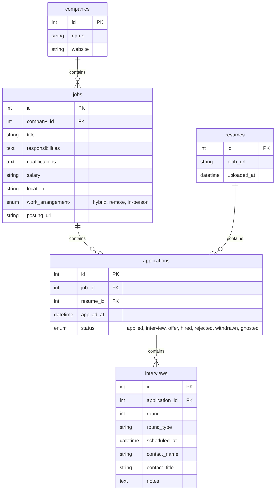

```mermaid
erDiagram
    companies ||--o{ jobs : contains
    companies {
        int id PK
        string name
        string website
    }
    jobs ||--o{ applications : contains
    jobs {
        int id PK
        int company_id FK
        string title
        text responsibilities
        text qualifications
        string salary
        string location
        enum work_arrangement- "hybrid, remote, in-person"
        string posting_url
    }
    resumes ||--o{ applications : contains
    resumes {
        int id PK
        string blob_url
        datetime uploaded_at
    }
    applications ||--o{ interviews : contains
    applications {
        int id PK
        int job_id FK
        int resume_id FK
        datetime applied_at
        enum status "applied, interview, offer, hired, rejected, withdrawn, ghosted"
    }
    interviews {
        int id PK
        int application_id FK
        int round
        string round_type
        datetime scheduled_at
        string contact_name
        string contact_title
        text notes
    }
```